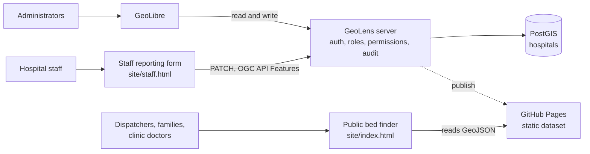

# Accra Hospital Bed Availability

A live map of emergency, ICU, and general ward bed availability across hospitals in Accra. Hospital staff report their counts twice daily. Ambulance dispatchers, families, and clinic doctors search the map and call ahead before travelling.

The system runs entirely on free and open-source software, self-hosted, with no metered usage, no per-seat charges, and no vendor account.

---

## Contents

- [Stack](#stack)
- [Architecture](#architecture)
- [Status model](#status-model)
- [Data](#data)
- [Interfaces](#interfaces)
- [Deployment](#deployment)
- [Custom domain](#custom-domain)
- [Roles and permissions](#roles-and-permissions)
- [Repository layout](#repository-layout)
- [Open questions](#open-questions)

---

## Stack

| Layer | Component | Licence | Role |
|---|---|---|---|
| Map UI | GeoLibre | MIT | Map rendering, layer styling, attribute table, desktop and mobile clients |
| Map engine | MapLibre GL JS | BSD-3 | Vector rendering |
| Data and API | GeoLens | Apache-2.0 | PostGIS catalog, OGC API endpoints, authentication, per-dataset permissions, audit log |
| Database | PostGIS | Open source | Hospital records as standard spatial data |
| Basemap | OpenFreeMap | Open | Background tiles, no API key |

No component in this stack meters usage, charges per seat, or expires after a trial period.

### Design rationale

Commercial no-code platforms are a natural fit for a project of this shape, and were evaluated first. They were rejected on a single criterion: continuity of service. A bed availability map is only useful if it is running at the moment someone needs it, and platforms whose free tiers are bounded by row counts, sync operations, or active users introduce a failure mode where the service degrades precisely as usage grows.

GeoLens removes that constraint. It is a self-hosted catalog with its own authentication and role system, so the database, the permissions layer, and the API all run on infrastructure under direct control. Data is stored in standard PostGIS and exposed over open OGC APIs, which means the dataset remains portable and the system can be migrated without a rewrite.

---

## Architecture



The public finder reads the dataset directly and requires no server. The staff form writes through GeoLens, which enforces which account may edit which hospital.

GeoLibre provides an alternative interface over the same data. Its GeoLens integration connects to a self-hosted GeoLens server and adds datasets as signed vector tiles or OGC API Features GeoJSON, and writes edits back to the server feature by feature where the server permits it. This gives administrators the full GeoLibre environment, including the attribute table, styling panel, and browser-based geoprocessing tools, over the same records staff report into.

---

## Status model

Each hospital carries one of four states, derived from its reported bed counts.

| State | Condition | Meaning to the reader |
|---|---|---|
| Available | Beds free in all three categories | Space is expected |
| Limited | At or below threshold in any category | Call before travelling |
| Full | Zero beds in any category | No capacity |
| Not reported | No counts submitted | Availability unknown |

Default thresholds are three emergency beds, two ICU beds, and five general ward beds. These are configurable and should be set to match the operational definition agreed with participating hospitals.

The not-reported state is deliberate. A hospital that has not submitted counts renders an em dash rather than a zero, because a zero is a claim about capacity and an absent report is not. Distinguishing the two prevents a dispatcher from reading missing data as a full ward.

Status colours use a colourblind-safe palette rather than pure red and green. Red-green colour blindness affects roughly eight percent of men, and the map is read under time pressure where misreading a colour has direct consequences.

### Keeping status in sync

Threshold logic exists in three places: `data/update_status.py`, `site/index.html`, and `site/staff.html`. The Python and JavaScript implementations are cross-checked against a shared set of test cases. Any change to thresholds must be applied to all three.

Recompute status and marker colours across the dataset after a bulk edit:

```bash
python3 data/update_status.py data/hospitals.geojson
```

Per-feature colouring requires no separate style file. GeoLibre renders a vector layer per-feature when its features carry simplestyle-spec properties, reading each feature's own colour and falling back to the flat layer style.

---

## Data

`data/hospitals.geojson` contains eight Accra hospitals in standard GeoJSON.

Identity fields, covering name, type, area, address, and published phone numbers, are sourced from public directories and reference sources. Bed, ICU, and oxygen figures are null and marked as not reported, because these figures are not public information and must originate from the hospitals themselves.

### Prerequisites for production use

The dataset is a scaffold, not a deployable record set. Before the map carries real traffic:

- Verify every coordinate against the actual building footprint. Several are approximate and flagged in the `notes` field of the affected features.
- Confirm every phone number directly with the hospital. Several were not found in public sources and are blank.
- Obtain written agreement from each participating hospital before publishing its bed data.

A map showing stale or incorrect bed counts during an emergency is worse than no map. The not-reported state exists so that missing data is visibly missing rather than silently rendered as zero.

---

## Interfaces

### Public bed finder

`site/index.html` is a standalone page requiring no backend. It reads the GeoJSON dataset directly and provides a map, filters, status colouring, and tap-to-call.

Colour is reserved exclusively for status. The status band, the tag, and the map pin are the only chromatic elements on the page, so the single most prominent thing on screen is the answer to whether a hospital can accept a patient. Bed counts render as monospace readouts with tabular figures, which keeps digits aligned when a list is scanned quickly.

### Staff reporting form

`site/staff.html` authenticates against GeoLens, loads the hospitals the account is permitted to see, prefills current counts, previews the resulting status before submission, and validates that all three counts and a reporter name are present.

Failure states name both the cause and the remedy. A permissions error directs the reporter to request editor access on that hospital. An endpoint mismatch directs them to the interactive API documentation on their own instance.

---

## Deployment

### Static site, no server

Publishing `site/` to GitHub Pages produces a working, shareable map with no backend and no cost.

1. Push the repository to GitHub.
2. Under repository settings, in the Pages section, set the source to GitHub Actions.
3. Push to `main`.

The workflow at `.github/workflows/pages.yml` validates the dataset before deploying and fails the build if any hospital falls outside Greater Accra, preventing a bad coordinate from reaching the live map.

At this stage the map, filters, status colours, and tap-to-call are fully functional. Only staff reporting requires a server.

### GeoLens server, for staff reporting

See `geolens/SETUP.md` for installation, dataset publication, granting each staff account editor access to its own hospital, and confirming the write endpoint against the running instance.

### Opening the dataset in GeoLibre

GeoLibre Web opens hosted data through a `data` query parameter accepting GeoJSON among other formats:

```
https://web.geolibre.app/?data=https://<username>.github.io/<repo>/data/hospitals.geojson
```

This provides the complete GeoLibre interface over the same dataset.

---

## Custom domain

GitHub Pages serves static files and can host `site/` and the dataset. It cannot host GeoLens, which requires a server, a database, and persistent storage.

A staged path avoids blocking the map on infrastructure:

1. GitHub Pages serves the public finder. Read-only, free, available immediately.
2. GeoLens runs on a virtual machine, the dataset is published into it, and staff reporting goes live.
3. The custom domain points at that server, with static pages served from the same origin.

Serving the application and its data from one origin removes the CORS and cookie problems that arise when they are split across hosts.

GitHub Pages takes a `CNAME` file in the repository containing the domain, plus a DNS CNAME record pointing at `<username>.github.io`. The GeoLibre project follows this same pattern: its plugin registry is published to GitHub Pages at `plugins.geolibre.app`.

---

## Roles and permissions

GeoLens provides role-based access control with per-dataset permissions, OAuth 2.0 and OIDC sign-in, and audit logging of administrative actions.

| User | Role | Action | Frequency |
|---|---|---|---|
| Hospital staff | Editor, scoped to own hospital | Report bed counts | Twice daily |
| Ambulance dispatchers | Viewer | Locate nearest available bed | During emergencies |
| Families and private drivers | Public | Locate nearest hospital, call ahead | During emergencies |
| Clinic doctors | Viewer | Identify referral hospitals with capacity | As needed |
| System administrator | Admin | Manage hospitals, accounts, permissions | As needed |

Audit logging is a safety requirement rather than a convenience feature. When a dispatcher acts on a bed count, the provenance of that number, specifically who reported it and when, is part of the record.

---

## Repository layout

```
accra-beds/
├── data/
│   ├── hospitals.geojson       Hospital dataset
│   └── update_status.py        Recomputes status and marker colours
├── site/
│   ├── index.html              Public bed finder
│   ├── staff.html              Staff reporting form
│   └── data/                   Dataset copy served by Pages
├── geolens/
│   └── SETUP.md                Server installation and configuration
└── .github/workflows/
    └── pages.yml               Validation and deployment
```

---

## Open questions

**Reporting interface.** Staff may report through the purpose-built form or through the GeoLibre attribute table. The attribute table requires no additional code; the form is more suitable for staff working on a phone at shift change.

**SMS reporting.** Carriers charge per message on every platform, making this the one component that cannot be free. It remains out of scope pending a decision on whether the cost is justified for hospitals without reliable data access.

**Hospital participation.** Live bed data requires agreements with each participating hospital. No production deployment is possible until these are in place.

---

## Licence and attribution

Built with [GeoLibre](https://geolibre.app/) (MIT), [GeoLens](https://getgeolens.com/) (Apache-2.0), [MapLibre GL JS](https://maplibre.org/) (BSD-3), and [OpenFreeMap](https://openfreemap.org/) tiles.

This system is a student project and is not an official emergency service. In an emergency in Ghana, contact the National Ambulance Service on 112.
