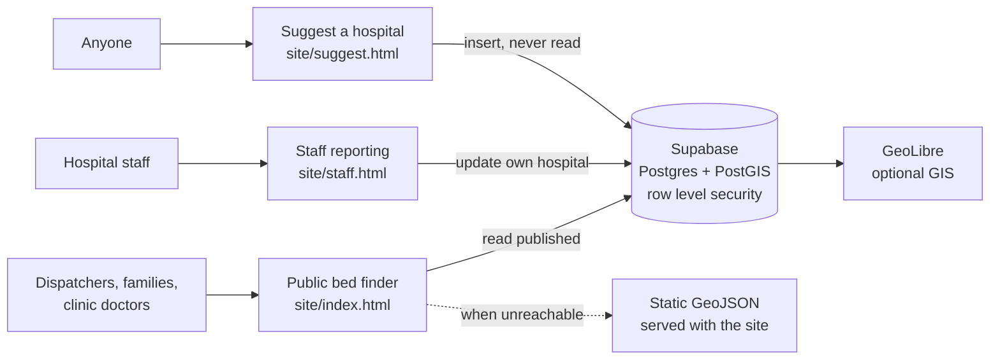

# Accra Hospital Bed Availability

A live map of emergency, ICU, and general ward bed availability across hospitals in Accra. Hospital staff report their counts twice daily. Ambulance dispatchers, families, and clinic doctors search the map and call ahead before travelling.

The system runs on a static site and a managed database. Nothing needs to be kept running by hand, and both layers have free tiers sufficient for this workload.

---

## Contents

- [Statement of need](#statement-of-need)
- [Stack](#stack)
- [Architecture](#architecture)
- [Status model](#status-model)
- [Access model](#access-model)
- [Data](#data)
- [Interfaces](#interfaces)
- [Deployment](#deployment)
- [Repository layout](#repository-layout)
- [Open questions](#open-questions)

---

## Statement of need

"No bed syndrome" is the Ghanaian phrase for being turned away from a hospital
with the explanation that no bed is available. Yevoo et al. reviewed the
published and grey literature together with print and electronic media from
January 2014 to February 2021 and found the term describes patients presenting
as emergencies being sent on to another facility without preliminary
examination or management, with reported cases of people dying while going
round multiple hospitals seeking help. They found the situation most acute in
the highly urbanised and densely populated Greater Accra region, and noted
that despite the phrase being familiar in Ghana there is very little about it
in medical texts or the peer reviewed literature.

The problem is not only that beds are scarce. It is that **nobody outside a
given hospital knows which hospital has one**. A family or an ambulance crew
discovers capacity by driving to a hospital and asking. Each attempt costs the
time of a round trip, and the information gained expires almost immediately.
A dispatcher on one side of Accra has no way of knowing that a hospital on the
other side could accept the patient.

### What existing tools do not cover

Work on geographic access to emergency care in Africa is well developed. Ouma
et al. assembled a geocoded inventory of public hospitals across 48 countries
of sub-Saharan Africa and modelled travel times, estimating that 287 million
people live more than two hours from the nearest hospital. That literature
answers *where the hospitals are*. It does not answer *which of them can take a
patient right now*, because the underlying facility inventories are static by
design.

Conversely, hospital bed management systems and e-referral platforms do track
live capacity, but they are built for clinicians inside an institution or a
formal referral network. Sanjaya et al. built a referral decision support
system in Yogyakarta, Indonesia that combined hospital coordinates, claim-data
knowledge of each hospital's competency, and bed availability, using the Google
Maps API to rank candidate hospitals by distance. It is close in mechanism to
this project and demonstrates the approach works in a low- and middle-income
setting, but it serves referring physicians operating inside the national
insurance platform. A family standing at a hospital gate at two in the morning
is not a user of any such system.

The gap this project addresses sits between those two bodies of work: a
**public, real-time view of bed availability, addressed to whoever is trying to
reach care**, rather than to the institutions between them.

### Who this is for

- **Ambulance dispatchers and crews**, deciding where to convey a patient.
- **Families**, who in practice make this decision themselves and are the group
  the literature describes as driving between hospitals.
- **Clinic and district hospital doctors** arranging a referral upward.
- **Hospital staff**, who report their own ward's counts and gain a
  low-effort way to signal capacity without fielding repeated phone calls.

### What the software provides

A live map and list of emergency, ICU and general ward availability across
Greater Accra, readable without an account, on a phone, over a poor
connection. Facilities can be sorted by distance from the reader's position.
Every listing carries a phone number for tap-to-call, because the map is meant
to inform a call rather than replace one.

Three design commitments follow directly from the setting rather than from
convenience:

1. **An absent report is not a zero.** A hospital that has not reported renders
   a dash, never a count, so missing data cannot be read as a full ward.
2. **Status is derived in the database, not asserted by a client**, so the
   colour on the map cannot disagree with the counts behind it.
3. **The read path survives the write path failing.** The map is static files
   on a CDN with a published fallback dataset, so it still answers when the
   database is unreachable.

### Current status

The platform is built and deployed. The public map, staff reporting, staff
registration and approval, and facility suggestion and review are all live and
working end to end.

What the system does not yet have is participating hospitals. The twenty-two
facilities listed carry identity data drawn from public directories, with bed
figures null and every hospital displaying as *not reported* until a hospital
reports. Nineteen of twenty-two coordinates are approximate and are flagged as
such on the map, so that no reader treats an unverified pin as confirmed.

No claim is made here about reduced transfer times, because measuring that
requires live reporting from real wards. Establishing hospital participation is
therefore the next step, and the basis of any evaluation that follows. The
software is ready for a pilot; the pilot is what produces the evidence.

### References

Yevoo, L.L., Amarteyfio, K.A., Ansah-Antwi, J.A., Wallace, L., Menka, E.,
Ofori-Ansah, G., Nyampong, I., Mayeden, S., & Agyepong, I.A. (2023). The "No
bed syndrome" in Ghana — what, how and why? A literature, electronic and print
media review. *Frontiers in Health Services*, 3, 1012014.
https://doi.org/10.3389/frhs.2023.1012014

Ouma, P.O., Maina, J., Thuranira, P.N., Macharia, P.M., Alegana, V.A., English,
M., Okiro, E.A., & Snow, R.W. (2018). Access to emergency hospital care
provided by the public sector in sub-Saharan Africa in 2015: a geocoded
inventory and spatial analysis. *The Lancet Global Health*, 6(3), e342–e350.
https://doi.org/10.1016/S2214-109X(17)30488-6

Sanjaya, G.Y., Lazuardi, L., Hasanbasri, M., & Kusnanto, H. (2019). Using
hospital claim data to develop referral decision support systems: improving
patient flow from the primary care. *Procedia Computer Science*, 161, 441–448.
https://doi.org/10.1016/j.procs.2019.11.143

Health Institutions and Facilities Act, 2011 (Act 829), Republic of Ghana.

---

## Stack

| Layer | Component | Role |
|---|---|---|
| Hosting | Vercel | Serves the static pages and the fallback dataset |
| Data | Supabase (Postgres + PostGIS) | Hospital records, authentication, row level security |
| Map | MapLibre GL JS | Vector rendering |
| Basemap | OpenFreeMap | Background tiles, no API key |
| GIS (optional) | GeoLibre | Analysis and field capture over the same data |

There is no application server. The browser talks to Postgres through Supabase's REST layer, and the database enforces who may do what.

### Design rationale

Two requirements govern the architecture. Both come from the setting rather than from preference, and everything else follows from them.

**The read path must survive anything.** Someone opens this during an emergency, at the moment the system is least able to afford a failure. The public map is therefore static files on a CDN: no server to fall over, no capacity ceiling to reach under a traffic spike, and a published fallback dataset so the page still answers when the database is unreachable. Live counts when the database is reachable, last-known counts when it is not, and never a blank map.

**The write path must not depend on infrastructure anyone has to keep running.** Hospital staff report directly to a managed database with no application server in between. There is nothing to restart, patch, or remember to start again, which removes the most common cause of outage in deployments of this size and keeps operating cost at zero.

Row level security is what makes that architecture safe. Access rules live in the database rather than in application code, so the browser holds only a public key and still cannot do anything the policies forbid. Enforcement does not depend on a server being present to perform it, and it cannot be bypassed by anything a client sends.

---

## Architecture



The public map reads Supabase when it can and falls back to the dataset published alongside the page when it cannot. Live counts when the database is reachable, last-known counts when it is not, and never a blank map.

---

## Status model

Each hospital carries one of four states.

| State | Condition | Meaning to the reader |
|---|---|---|
| Available | Beds free in all three categories | Space is expected |
| Limited | At or below threshold in any category | Call before travelling |
| Full | Zero beds in any category | No capacity |
| Not reported | No counts submitted | Availability unknown |

Status is a **generated column** in Postgres, computed from the bed counts and never written by a client. Deriving it in the database rather than in the interface means a client cannot report counts that disagree with the colour shown on the map, and the threshold logic exists in exactly one place.

Default thresholds are three emergency beds, two ICU beds, and five general ward beds, set in `supabase/migrations/0001_core.sql`.

The not-reported state is deliberate. A hospital that has not submitted counts renders a dash rather than a zero, because a zero is a claim about capacity and an absent report is not. Distinguishing the two prevents a dispatcher reading missing data as a full ward.

Status colours use a colourblind-safe palette rather than pure red and green. Red-green colour blindness affects roughly eight percent of men, and the map is read under time pressure where misreading a colour has direct consequences.

---

## Access model

Three tiers, enforced by row level security rather than by application code.

| Tier | Who | Can do | Cannot do |
|---|---|---|---|
| Public | Anyone, signed in or not | Read published hospitals, submit a suggestion, request staff access | Read suggestions, alter any hospital |
| Applicant | Registered but unapproved | Sign in, see their request status | Report for any hospital |
| Staff | Approved and linked to a hospital | Update that hospital's counts, phone, address and notes | Touch another hospital, or move any pin |
| Administrator | Supabase dashboard | Approve requests, publish hospitals, review suggestions | — |

A staff account is two things: a user, and a row in `hospital_staff` linking it to a hospital. Registration creates the first; only an approval writes the second. Without the link the account signs in but sees nothing and can change nothing. That is the intended behaviour, not a fault, and it is what makes open sign-ups safe.

### Staff registration

Staff register themselves at `site/register.html`, choosing their hospital and describing how their role can be confirmed. The request lands in `staff_requests` with status `pending`.

An administrator confirms the person actually works there, then runs `approve_staff_request()`, which grants the access and records the decision in one transaction. `reject_staff_request()` records a reason, which the applicant sees the next time they sign in.

Hospital suggestions follow the same shape: `approve_hospital_suggestion()` publishes the facility and marks the submission handled together, and refuses a name that is already listed so a duplicate cannot reach the map. A newly published hospital carries `unverified` confidence unless the reviewer states otherwise, so readers are told to call ahead until the pin has been checked on the ground.

The verification step is not a formality. An approved account can change what a dispatcher sees during an emergency, so the evidence field is the only thing standing between a stranger and a hospital's bed data.

Suggestions are held in a separate table that anyone may write to and nobody may read from. An anonymous submission therefore cannot reach the map, and the submitter's contact details are not publicly readable.

### Why suggestions are gated

The Health Institutions and Facilities Act, 2011 (Act 829) established the Health Facilities Regulatory Agency (HeFRA), which licenses health facilities in Ghana. Section 11(1) provides that a facility may not operate unless licensed.

Two failure modes justify review. An ambulance routed to a facility that does not exist, or cannot provide the care needed, loses time measured in minutes. And publishing an unlicensed facility would direct patients to an operation not lawfully permitted to treat them. Neither is an acceptable price for the convenience of open self-registration.

---

## Data

`data/hospitals.geojson` holds twenty-two Accra hospitals and remains the source of truth for hospital identity. `supabase/seed.sql` is generated from it by `data/generate_seed.py`, so edits are made to the GeoJSON and the SQL is derived.

Identity fields come from public directories. Bed, ICU and oxygen figures are null, because those figures are not public and must originate from the hospitals themselves.

### Prerequisites for production use

- Verify every coordinate against the actual building. Nineteen of twenty-two are approximate and flagged as such; the map warns readers on these.
- Confirm every phone number with the hospital. Several were not found in public sources and are blank.
- Obtain written agreement from each participating hospital before publishing its bed data.

GeoLibre's field collection tool is suited to the coordinate work: it captures a point from device GPS with an optional photo, and works offline, so positions can be confirmed on site and exported back into the dataset.

---

## Interfaces

**`site/index.html`** is the public finder, requiring no account. A reader can share their device location or type an area, and the list reorders nearest first with a distance on every card. Areas already in the dataset are matched locally before any network call, so the common case costs nothing and still works when the geocoder is unreachable; anything else is looked up through OpenStreetMap, bounded to Greater Accra so a common place name cannot drop the reader on another continent.

Distances are straight-line and the interface says so. In Accra traffic the nearer hospital is not reliably the faster one, so the figure is a guide for choosing between candidates, and Directions gives real routing.

 Colour is reserved exclusively for status, so the most prominent thing on screen is whether a hospital can accept a patient. Bed counts render as monospace readouts with tabular figures, which keeps digits aligned when a list is scanned quickly. Directions open turn-by-turn routing from the reader's current location.

Staff may also correct their own hospital's contact details, in a panel kept separate from the daily report so the twice-daily task stays short. Which fields they may touch is set by column privileges rather than by hiding inputs: bed counts, phone, address, area, type and notes are theirs; name, position, published state and licence number are the administrator's. The split follows the cost of being wrong, since a wrong phone number wastes a call while a wrong position sends an ambulance to the wrong place.

**`site/staff.html`** signs in against Supabase, lists only the hospitals the account may edit, prefills current counts, previews the resulting status before submission, and requires all three counts plus a reporter name. The session persists, so staff are not asked to sign in twice a day.

**`site/register.html`** lets staff create their own account and request access to one hospital. It lists only published hospitals, so a request cannot name a facility that does not exist.

**`site/suggest.html`** accepts facility proposals from anyone, validates coordinates against the Greater Accra bounding box, and offers device geolocation instead of typing coordinates by hand. Rejecting out-of-area points catches transposed latitude and longitude, which is the most consequential data-entry error in the system.

---

## Deployment

### Database

See `supabase/SETUP.md`. Create the project, run the migration and seed, copy the project URL and anonymous key into `site/config.js`, then create staff accounts and assign them to hospitals.

### Site

The site is static, so it needs no build step.

1. Push the repository to GitHub.
2. In Vercel, import the repository.
3. Set **Root Directory** to `site`, Framework Preset to **Other**, and leave the build
   command empty.

Vercel redeploys on every push to `main`.

`vercel.json` sets caching: pages revalidate on each request so a change is live
immediately, while the fallback dataset is cached briefly.

No environment variables are needed. There is no build step to read them, so the Supabase
project URL and publishable key live in `site/config.js`, which is meant to be public. The
protection is the row level security policies, not secrecy about the key. The service role
key bypasses those policies and must never appear in the repository.

### Custom domain

In Vercel, add the domain under Settings, Domains, then create the DNS record it shows. A certificate is issued automatically.

---

## Repository layout

```
.
├── data/
│   ├── hospitals.geojson       Source of truth for hospital identity
│   ├── generate_seed.py        Derives seed.sql from the GeoJSON
│   └── update_status.py        Recomputes status in the GeoJSON fallback
├── site/
│   ├── index.html              Public bed finder
│   ├── staff.html              Staff reporting
│   ├── suggest.html            Public facility suggestion
│   ├── register.html           Staff access request
│   ├── login.html              Staff sign-in
│   ├── config.js               Supabase URL and anonymous key
│   ├── favicon.svg
│   └── data/                   Dataset copy served by Pages
├── supabase/
│   ├── migrations/
│   │   ├── 0001_core.sql         Schema, policies, generated status
│   │   ├── 0002_staff_requests.sql  Registration and approval
│   │   ├── 0003_suggestion_review.sql  Suggestion approval
│   │   └── 0004_staff_editable_columns.sql  Column privileges
│   ├── seed.sql                  Generated hospital records
│   └── SETUP.md                  Dashboard walkthrough
└── vercel.json                 Hosting and cache rules
```

---

## Open questions

**Suggestion abuse.** The suggestion table accepts anonymous inserts with no rate limit. Acceptable while the project is small; a per-IP limit or a sign-in requirement would be needed at scale.

**Project pausing.** Supabase pauses free projects after a period of inactivity. Daily reporting keeps it awake, but a long university break might not.

**SMS reporting.** Carriers charge per message on every platform, so this is the one component that cannot be free. Out of scope pending a decision on whether the cost is justified for hospitals without reliable data access.

**Hospital participation.** Live bed data requires agreements with each participating hospital. No production deployment is possible until these are in place.

---

## Licence and attribution

Built with [MapLibre GL JS](https://maplibre.org/) (BSD-3), [OpenFreeMap](https://openfreemap.org/) tiles, [Supabase](https://supabase.com/) (Apache-2.0), and optionally [GeoLibre](https://geolibre.app/) (MIT).

This system is a student project and is not an official emergency service. In an emergency in Ghana, contact the National Ambulance Service on 112.
